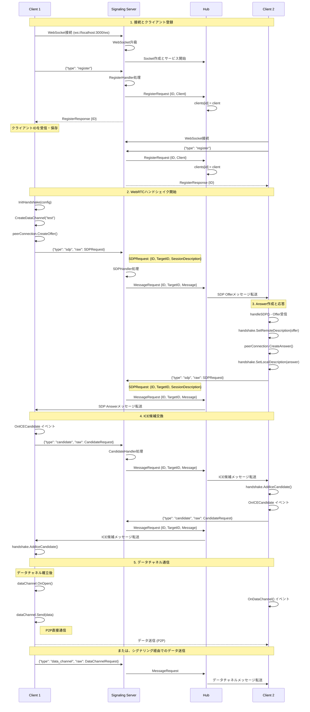
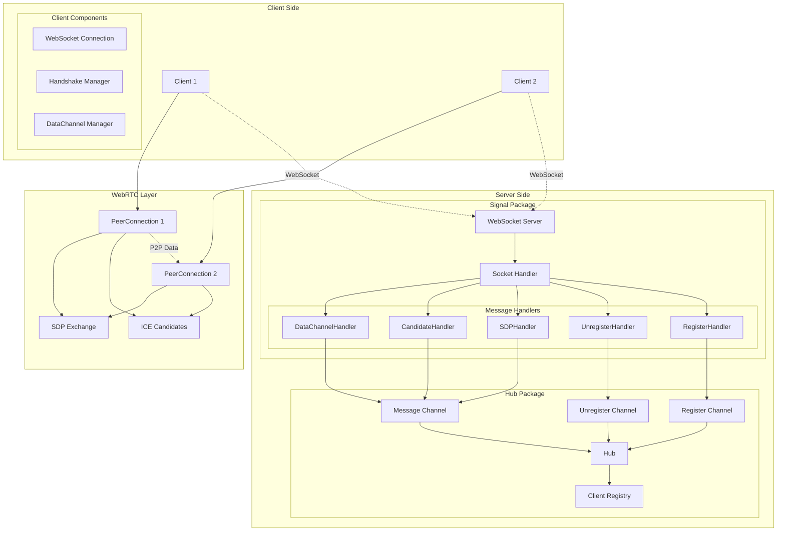

# Conic

WebSocket接続を使用したリアルタイムピアツーピア通信を促進するGo言語ベースのWebRTCシグナリングサーバーです。

## 機能

- WebRTC接続用のWebSocketベースシグナリングサーバー
- クライアント登録とメッセージルーティング
- SDP（Session Description Protocol）交換のサポート
- NAT越えのためのICE候補交換
- **データチャネルによるP2P通信サポート**
- **自動WebRTCハンドシェイク処理（Offer/Answer）**
- **リアルタイムチャット機能**
- Goチャンネルを使用した並行メッセージ処理
- クリーンなインターフェースベースのアーキテクチャ

## 必要要件

- Go 1.24.5 以降
- 依存関係ダウンロード用のインターネット接続

## インストール

```bash
# リポジトリをクローン
git clone https://github.com/HMasataka/conic.git
cd conic

# 依存関係をインストール
go mod tidy
```

## 使用方法

### P2P通信デモ

完全なWebRTCピアツーピア通信を体験できます：

```bash
# インタラクティブP2Pクライアントを起動
task p2p

# オファー側として起動
task p2p-offer
# または
task p2p -- -role=offer

# アンサー側として起動
task p2p-answer
# または
task p2p -- -role=answer
```

P2P通信デモの使い方：

1. **サーバー起動**: まずシグナリングサーバーを起動

   ```bash
   task server
   ```

2. **2つのクライアントを起動**: 別々のターミナルで

```bash
# ターミナル1: オファー側
task p2p-offer

# ターミナル2: アンサー側
task p2p-answer
```

3. **P2P接続の確立**: オファー側でターゲットのピアIDを入力すると自動的にWebRTCハンドシェイクが開始されます

4. **リアルタイム通信**: 接続が確立されるとデータチャネル経由でのリアルタイム通信が可能になります

#### インタラクティブモードのコマンド

```bash
task p2p
```

利用可能なコマンド：

- `offer <peer_id>` - 指定したピアにWebRTCオファーを作成・送信
- `channel <label>` - 新しいデータチャネルを作成
- `send <label> <message>` - データチャネル経由でメッセージ送信
- `list` - アクティブなデータチャネルを一覧表示
- `quit` - 終了

## クイックスタート

P2P通信を素早く体験するには：

```bash
# ターミナル1: サーバー起動
task server

# ターミナル2: オファー側クライアント起動
task p2p-offer

# ターミナル3: アンサー側クライアント起動
task p2p-answer
```

1. オファー側でアンサー側のピアIDを入力
2. WebRTC接続が自動確立
3. データチャネル経由でリアルタイム通信開始！

## API

### WebSocketエンドポイント

- **URL**: `ws://localhost:3000/ws`
- **プロトコル**: JSONメッセージを使用するWebSocket

### メッセージタイプ

#### クライアント登録

```json
{
  "type": "register"
}
```

#### クライアント登録解除

```json
{
  "type": "unregister",
  "raw": "{\"ID\": \"client-id\"}"
}
```

#### SDPオファー/アンサー送信

```json
{
  "type": "sdp",
  "raw": "{\"ID\": \"sender-id\", \"TargetID\": \"receiver-id\", \"SessionDescription\": {...}}"
}
```

#### ICE候補送信

```json
{
  "type": "candidate",
  "raw": "{\"ID\": \"sender-id\", \"TargetID\": \"receiver-id\", \"Candidate\": \"candidate-string\"}"
}
```

#### データチャネルメッセージ送信

```json
{
  "type": "data_channel",
  "raw": "{\"ID\": \"sender-id\", \"TargetID\": \"receiver-id\", \"Label\": \"channel-name\", \"Data\": \"base64-encoded-data\"}"
}
```

## アーキテクチャ

### コアコンポーネント

- **Hub**: クライアント接続を管理し、メッセージをルーティングする中央メッセージルーティングシステム
- **WebSocket Server**: WebSocket接続とプロトコルアップグレードを処理
- **Client**: シグナリングサーバーへの接続用WebSocketクライアント実装
- **Handshake**: ICE候補処理を含むWebRTCピア接続管理

### WebRTCシグナリングプロセス



### アーキテクチャ構成図



## 開発

### 利用可能なコマンド

```bash
# サーバーを起動
task server

# クライアントを起動
task client

# シグナルアプリを起動
task signal

# P2P通信デモを起動
task p2p

# P2P通信デモ（オファー側）を起動
task p2p-offer

# P2P通信デモ（アンサー側）を起動
task p2p-answer

# 利用可能なすべてのタスクを表示
task --list

# プロジェクトをビルド
task build

# テストを実行（利用可能な場合）
task test

# コードをフォーマット
task fmt

# コードの問題をチェック
task vet

# 依存関係を整理
task tidy

# ビルド成果物をクリーンアップ
task clean

# 開発ツールをインストール
task install-tools

# ホットリロード付きでサーバーを起動（airが必要）
task dev-server
```

### プロジェクト構造

```bash
/
├── cmd/
│   ├── client/       # 基本WebSocketクライアント
│   ├── server/       # WebRTCシグナリングサーバー
│   ├── signal/       # シグナルアプリケーション
│   └── p2p/          # P2P通信デモ
├── signal/
│   ├── websocket.go  # WebSocketサーバー実装
│   └── handler.go    # メッセージハンドラー実装
├── hub/
│   └── hub.go        # メッセージハブとルーティング
├── client.go         # クライアント実装（データチャネル管理含む）
├── handshake.go      # WebRTCハンドシェイク管理
├── go.mod            # Goモジュール定義
└── Taskfile.yml      # タスクランナー設定
```
