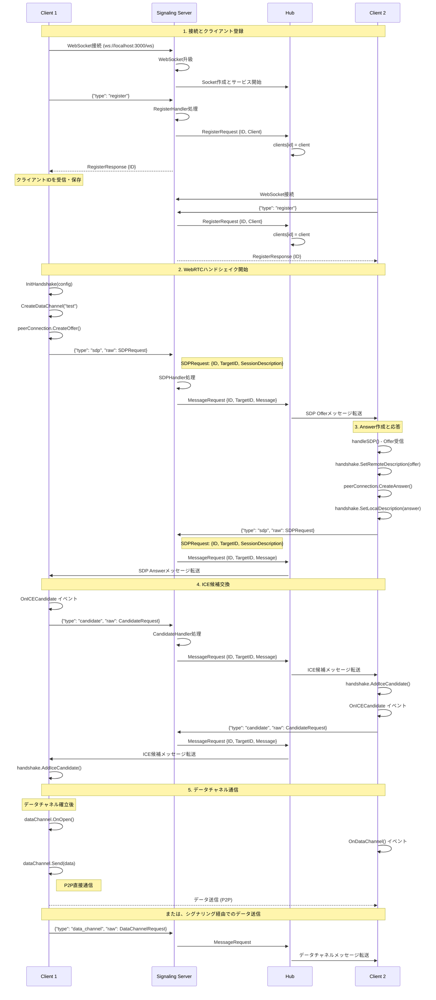
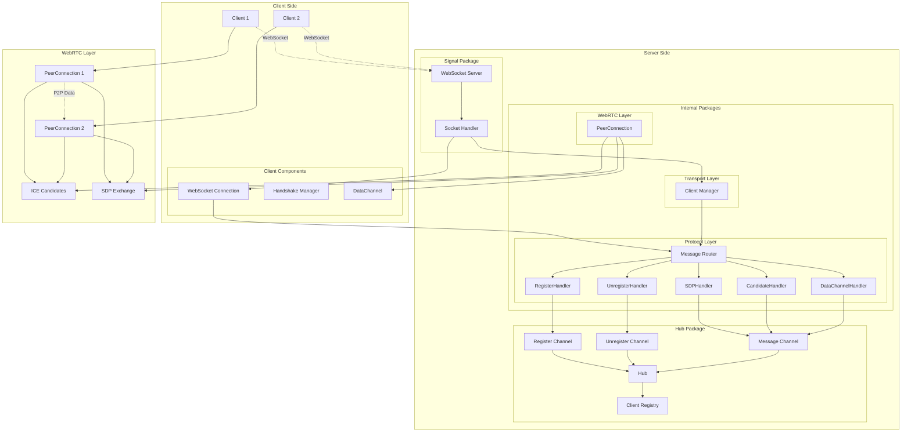

# Conic

WebSocket接続を使用したリアルタイムピアツーピア通信を促進するGo言語ベースのWebRTCシグナリングサーバーです。

## 機能

- WebRTC接続用のWebSocketベースシグナリングサーバー
- クライアント登録とメッセージルーティング
- SDP（Session Description Protocol）交換のサポート
- NAT越えのためのICE候補交換
- **データチャネルによるP2P通信サポート**
- **自動WebRTCハンドシェイク処理（Offer/Answer）**
- **リアルタイムチャット機能**
- Goチャンネルを使用した並行メッセージ処理
- クリーンなインターフェースベースのアーキテクチャ

## 必要要件

- Go 1.24.5 以降
- 依存関係ダウンロード用のインターネット接続

## インストール

```bash
# リポジトリをクローン
git clone https://github.com/HMasataka/conic.git
cd conic

# 依存関係をインストール
go mod tidy
```

## 使用方法

### サンプル作成

```bash
task generate-audio
```

### データチャネルP2P通信デモ

完全なWebRTCピアツーピア通信を体験できます：

```bash
# インタラクティブなP2Pクライアントを起動
task datachannel

# オファー側として起動
task datachannel -role=offer

# アンサー側として起動
task datachannel -role=answer
```

#### デモの使い方

1. **サーバー起動**: まずシグナリングサーバーを起動

   ```bash
   task signal
   ```

2. **2つのクライアントを起動**: 別々のターミナルで

   ```bash
   # ターミナル1: オファー側
   task datachannel -role=offer

   # ターミナル2: アンサー側
   task datachannel -role=answer
   ```

3. **P2P接続の確立**: オファー側でターゲットのピアIDを入力すると  
   自動的にWebRTCハンドシェイクが開始されます

4. **リアルタイム通信**: 接続が確立されるとデータチャネル経由での  
   リアルタイム通信が可能になります

#### 利用可能なコマンド

- `offer <peer_id>` - 指定したピアにWebRTCオファーを作成・送信
- `channel <label>` - 新しいデータチャネルを作成
- `send <label> <message>` - データチャネル経由でメッセージ送信
- `list` - アクティブなデータチャネルを一覧表示
- `quit` - 終了

### オーディオ・ビデオストリーミングデモ

オーディオおよびビデオストリーミングのデモも利用可能です：

```bash
# オーディオデモ（Opusコーデック）
task audio-offer    # オファー側
task audio-answer   # アンサー側

# ビデオデモ（VP8コーデック）
task video-offer    # オファー側
task video-answer   # アンサー側
```

## クイックスタート

P2P通信を素早く体験するには：

```bash
# ターミナル1: シグナリングサーバー起動
task signal

# ターミナル2: オファー側クライアント起動
task datachannel -role=offer

# ターミナル3: アンサー側クライアント起動
task datachannel -role=answer
```

1. オファー側でアンサー側のピアIDを入力
2. WebRTC接続が自動確立
3. データチャネル経由でリアルタイム通信開始！

## API

### WebSocketエンドポイント

- **URL**: `ws://localhost:3000/ws`
- **プロトコル**: JSONメッセージを使用するWebSocket

### メッセージタイプ

#### クライアント登録

```json
{
  "type": "register"
}
```

#### クライアント登録解除

```json
{
  "type": "unregister",
  "raw": "{\"ID\": \"client-id\"}"
}
```

#### SDPオファー/アンサー送信

```json
{
  "type": "sdp",
  "raw": "{\"ID\": \"sender-id\", \"TargetID\": \"receiver-id\", \"SessionDescription\": {...}}"
}
```

#### ICE候補送信

```json
{
  "type": "candidate",
  "raw": "{\"ID\": \"sender-id\", \"TargetID\": \"receiver-id\", \"Candidate\": \"candidate-string\"}"
}
```

#### データチャネルメッセージ送信

```json
{
  "type": "data_channel",
  "raw": "{\"ID\": \"sender-id\", \"TargetID\": \"receiver-id\", \"Label\": \"channel-name\", \"Data\": \"base64-encoded-data\"}"
}
```

## アーキテクチャ

### コアコンポーネント

#### Domain Layer (`domain/`)

- **Hub Interface**: メッセージルーティングの契約定義
- **Client Interface**: クライアント接続の契約定義
- **Message Types**: JSONマーシャリング対応のメッセージ型定義
- **統計情報**: Hub統計追跡機能

#### Internal Packages (`internal/`)

- **WebRTC (`internal/webrtc/`)**
  - `PeerConnection`: WebRTCピア接続管理（統計、ICE候補キューイング、エラー処理）
  - `DataChannel`: データチャネル管理（統計、イベントハンドラー、スレッドセーフ操作）
- **Transport (`internal/transport/`)**
  - `Client`: サーバーサイドクライアント表現
  - `WebSocket Connection`: WebSocket接続管理・アップグレード処理
- **Protocol (`internal/protocol/`)**
  - `Message Handlers`: メッセージタイプ別ハンドラー（register, SDP, candidate, data_channel）
  - `Router`: メッセージルーティング設定

#### Hub Implementation (`hub/`)

- **Central Routing**: クライアント登録・登録解除管理
- **Message Broadcasting**: 接続クライアント間のメッセージルーティング
- **Connection Tracking**: 接続統計と管理
- **Concurrent Processing**: Goチャンネルを使用した並行処理

#### Audio Package (`internal/audio/`)

- **WAV Format**: WAVファイル形式の処理
- **Sample Generation**: テスト用サンプルオーディオの生成

#### Logging (`logging/`)

- **構造化ログ**: Go `slog`パッケージ使用
- **コンテキスト対応**: コンテキスト認識ログ
- **設定可能**: レベルとフォーマット（JSON/テキスト）設定可能

### WebRTCシグナリングプロセス



### アーキテクチャ構成図



## 開発

### 利用可能なコマンド

```bash
# シグナリングサーバーを起動
task signal

# データチャネルデモを起動
task datachannel

# オーディオデモを起動
task audio-offer      # オファー側
task audio-answer     # アンサー側

# ビデオデモを起動
task video-offer      # オファー側
task video-answer     # アンサー側

# WAVサンプルを生成
task generate-audio

# プロジェクトをビルド
task build

# テストを実行
task test

# コードをフォーマット
task fmt

# コードの問題をチェック
task vet

# 依存関係を整理
task tidy

# ビルド成果物をクリーンアップ
task clean

# 利用可能なすべてのタスクを表示
task --list

# 開発ツールをインストール
task install-tools

# ホットリロード付きでサーバーを起動（airが必要）
task dev-server
```

### プロジェクト構造

```bash
/
├── cmd/                          # コマンドラインアプリケーション
│   ├── signal/main.go           # シグナリングサーバー
│   ├── datachannel/main.go      # データチャネルP2Pデモ
│   ├── audio/main.go            # オーディオストリーミングデモ
│   ├── video/main.go            # ビデオストリーミングデモ
│   └── generate-audio/main.go   # WAVサンプル生成ユーティリティ
├── internal/                     # 内部パッケージ（外部から非公開）
│   ├── protocol/                # メッセージルーティング・HTTP処理
│   │   ├── router.go            # HTTPルーター・WebSocket升級
│   │   └── handler.go           # メッセージハンドラー
│   ├── transport/               # WebSocket通信層
│   │   ├── websocket.go         # WebSocketサーバー
│   │   └── client.go            # クライアント表現・メッセージルーティング
│   ├── webrtc/                  # WebRTCラッパーコンポーネント
│   │   ├── peer.go              # PeerConnection ラッパー
│   │   ├── datachannel.go       # DataChannel ラッパー
│   │   ├── audiotrack.go        # AudioTrack ラッパー
│   │   ├── videotrack.go        # VideoTrack ラッパー
│   │   ├── candidate.go         # ICE候補処理
│   │   └── errors.go            # WebRTCエラー定義
│   └── audio/                   # オーディオユーティリティ
│       └── wav.go               # WAVフォーマット処理
├── domain/                       # コアインターフェース・ドメインモデル
│   ├── client.go                # クライアントインターフェース
│   ├── data.go                  # メッセージ型定義
│   └── hub.go                   # ハブインターフェース
├── hub/                         # ハブ実装
│   └── hub.go                   # 中央メッセージルーター
├── registry/                    # WebRTCレジストレーション処理
│   └── handler.go               # Offer/Answer レジストレーション
├── logging/                     # ログユーティリティ
│   ├── logger.go                # 構造化ログ実装
│   └── context.go               # ログコンテキスト
├── context.go                   # グローバルコンテキストユーティリティ
├── go.mod                       # Goモジュール定義
├── Taskfile.yml                 # タスクランナー設定
└── docs/                        # ドキュメント
    ├── webrtc-terminology.md    # WebRTC用語解説
    └── ice-explanation.md       # ICEプロトコル解説
```

## 参考文献

### Pion WebRTCを使用したP2Pシグナリングサーバープロジェクト

#### ファイル転送系

- **[webwormhole](https://github.com/saljam/webwormhole)** - P2P認証付きWebRTC通信
- **[peerbeam](https://github.com/6b70/peerbeam)** - 高速・セキュアなP2Pファイル転送
- **[gfile](https://github.com/Antonito/gfile)** - WebRTC経由の直接ファイル転送

#### ネットワーク・トンネリング系

- **[pleer](https://github.com/raphadam/pleer)** - WebRTC経由でローカルポートをセキュアに転送
- **[rtctunnel](https://github.com/rtctunnel/rtctunnel)** - WebRTC上のネットワークトンネル
- **[ssh-p2p](https://github.com/nobonobo/ssh-p2p)** - SSH P2Pトンネリングサーバー/クライアント

#### 公式リソース

- **[Pion WebRTC Examples](https://github.com/pion/example-webrtc-applications)** - 実用的なWebRTCアプリケーション例
- **[Awesome Pion](https://github.com/pion/awesome-pion)** - Pionを使用したプロジェクト集
